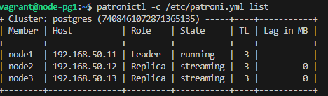

## [postgresql-ha-cluster](./)

- **Описание**: Этот проект предназначен для автоматизированного развертывания высокодоступного кластера PostgreSQL. Он включает в себя установку нескольких экземпляров PostgreSQL с репликацией и механизмом автоматического переключения на случай отказа.

- **Состав**: Кластерная архитектура PostgreSQL с использованием ETCD, Patroni и HAProxy.

   Patroni — это пакет Python с открытым исходным кодом, который управляет конфигурацией Postgres. Его можно настроить для обработки таких задач, как репликация, резервное копирование и восстановление.

   Etcd — это отказоустойчивое, распределенное хранилище ключей и значений, используемое для сохранения состояния кластера Postgres. При использовании Patroni все узлы Postgres используют etcd для поддержания работоспособности кластера Postgres. В проде имеет смысл использовать более крупный кластер etcd, чтобы в случае отказа одного узла etcd это не повлияло на серверы Postgres.

   HAProxy — это высокопроизводительный балансировщик нагрузки и обратный прокси-сервер с открытым исходным кодом для приложений TCP и HTTP.

- **Образ Vagrant**: `generic/debian12` v4.3.12 - amd64 - VirtualBox  
  Ссылка на образ - [generic/debian12 на Vagrant Cloud](https://app.vagrantup.com/generic/boxes/debian12).  
  Добавить образ можно через команду `vagrant box add generic/debian12 <path-to-file>`.

## Содержание

1. [Предварительные требования](#предварительные-требования)
2. [Настройка Vagrant](#настройка-vagrant)
3. [Запуск и управление](#запуск-и-управление)
4. [Файлы проекта](#файлы-проекта)
5. [Конфигурация PostgreSQL HA](#конфигурация-postgresql-ha)
6. [Конфигурация ETCD](#конфигурация-etcd)
7. [Конфигурация HAPROXY](#конфигурация-haproxy)

## Предварительные требования

- Установлен [Vagrant](https://www.vagrantup.com/downloads)
- Установлен [VirtualBox](https://www.virtualbox.org/wiki/Downloads)

## Настройка Vagrant

  **Добавление Vagrant Box**

   Сначала скачайте Vagrant Box `generic/debian12` и добавьте его с помощью команды:

   ```bash
   vagrant box add generic/debian12 <path-to-your-box-file>
   ```

## Запуск и управление

1. **Запуск виртуальной машины**

   Запустите виртуальную машину и выполните все шаги провизии с помощью команды:

   ```bash
   vagrant up
   ```

2. **Удаление и повторное создание виртуальной машины**

   Если требуется удалить текущую виртуальную машину и создать новую, используйте:

   ```bash
   vagrant destroy -f
   vagrant up
   ```

3. **Подключение к кластеру PostgreSQL**

   После запуска кластера PostgreSQL, можно подключиться к нему с локальной машины
   `psql -h <haproxynode_ip> -p 5000 -U postgres` в нашем случае ip haproxy `192.168.50.30`

4. **Проверка работы мастера PG**

   1. Способ. Переходим на haproxy `http://<haproxynode_ip>:7000/>`.

   2. Способ. Для проверки и мониторинга кластера можно подключиться к любой ноде, например `node1` командой `vagrant ssh node1` и использовать `patronictl -c /etc/patroni.yml list`

      

## Конфигурация PostgreSQL HA
<details>

  <summary>"/etc/patroni.yml"</summary>

```sh
scope: postgres
namespace: /db/
name: $node_name

restapi:
    listen: $nodeN_ip:8008
    connect_address: $nodeN_ip:8008

etcd:
    host: $etcdnode_ip:2379

bootstrap:
  dcs:
    ttl: 30
    loop_wait: 10
    retry_timeout: 10
    maximum_lag_on_failover: 1048576
    postgresql:
      use_pg_rewind: true
      use_slots: true
      parameters:

  initdb:
  - encoding: UTF8
  - data-checksums

  pg_hba:
  - host replication replicator 127.0.0.1/32 md5
  - host replication replicator $node1_ip/0 md5
  - host replication replicator $node2_ip/0 md5
  - host replication replicator $node3_ip/0 md5
  - host all all 0.0.0.0/0 md5

  users:
    admin:
      password: admin
      options:
        - createrole
        - createdb

postgresql:
  listen: $nodeN_ip:5432
  connect_address: $nodeN_ip:5432
  data_dir: /data/patroni
  pgpass: /tmp/pgpass
  authentication:
    replication:
      username: replicator
      password: replicator
    superuser:
      username: postgres
      password: postgres
  parameters:
      unix_socket_directories: '.'

tags:
    nofailover: false
    noloadbalance: false
    clonefrom: false
    nosync: false
```

</details>

## Конфигурация ETCD
<details>

  <summary>"/etc/default/etcd"</summary>

```sh
ETCD_LISTEN_PEER_URLS="http://$etcdnode_ip:2380"
ETCD_LISTEN_CLIENT_URLS="http://localhost:2379,http://$etcdnode_ip:2379"
ETCD_INITIAL_ADVERTISE_PEER_URLS="http://$etcdnode_ip:2380"
ETCD_INITIAL_CLUSTER="default=http://$etcdnode_ip:2380,"
ETCD_ADVERTISE_CLIENT_URLS="http://$etcdnode_ip:2379"
ETCD_INITIAL_CLUSTER_TOKEN="etcd-cluster"
ETCD_INITIAL_CLUSTER_STATE="new"
```

</details>

## Конфигурация HAPROXY

<details>

  <summary>"/etc/haproxy/haproxy.cfg"</summary>

```sh
global
    maxconn 100
    log 127.0.0.1 local2

defaults
    log global
    mode tcp
    retries 2
    timeout client 30m
    timeout connect 4s
    timeout server 30m
    timeout check 5s

# Раздел для статистики
listen stats
    mode http
    bind *:7000
    stats enable
    stats uri /

# Frontend для PostgreSQL запросов
frontend postgres
    bind *:5000
    acl is_write method POST PUT DELETE PATCH CONNECT TRACE
    use_backend pg_write if is_write           
    default_backend pg_read                    

# Backend для запросов на запись (только Leader)
backend pg_write
    option httpchk OPTIONS /master
    http-check expect status 200
    default-server inter 3s fall 3 rise 2 on-marked-down shutdown-sessions
    server node1 $node1_ip:5432 maxconn 100 check port 8008
    server node2 $node2_ip:5432 maxconn 100 check port 8008
    server node3 $node3_ip:5432 maxconn 100 check port 8008

# Backend для запросов на чтение (Replicas и Leader)
backend pg_read
    option httpchk OPTIONS /replica
    http-check expect status 200
    default-server inter 3s fall 3 rise 2 on-marked-down shutdown-sessions
    server node1 $node1_ip:5432 maxconn 100 check port 8008
    server node2 $node2_ip:5432 maxconn 100 check port 8008
    server node3 $node3_ip:5432 maxconn 100 check port 8008
```

</details>

## Файлы проекта

В каждом файле даны подробные комментарии на каждом шаге установки.

- `Vagrantfile` — конфигурационный файл Vagrant для создания виртуальных машин.
- `scripts/*.sh` — скрипты для начальной установки и настройки нод.
